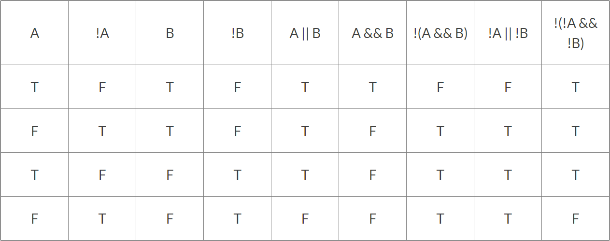

# Unit 3

**Unit 3: Lesson 1: Simple Ifs**
* **Condition**: What must fulfil the `if` statement for the 'body' to run. 
  * Ex:
  ```java
  if (<condition>)
    ```
* **Body**: The code within the `if` statement. Only runs if the 'condition' is true.
  * Ex:
  ```java
  {
    <body>
  }

* **Equality**: The simplest `if` statement, denoted by two equal signs (`==`). Note that `=` will not return a boolean value as it is an assignment operator.
  * Ex:
  ```java
  if (x == 3)
  {
    x++;
  }
  //If the value of x is equal to 3, then the body will add 1 to x.
  ```

---
**Unit 3: Lesson 2: Ifs - Making Decisions**
**Relational Operators**
* Equal to: `==`
* Less than: `<`
  * Less than or equal to: `<=`
* Greater than: `>`
  * Greater than or equal to: `>=`
* Unequal to: `!=`

**Order of Operation**
* When arithmetic operators are paired with relational operators, Java will run the arithmetic operators first.

Ex:
  ```java
  if (1 + 2 == 4 - 1){
  //Java will compute 1+2 and 4-1 before 2==4. Therefore, this if-statement will return true.
  ```
  * Parentheses will still be counted beforehand.
---
**Unit 3 Lesson 3: Else**

**Two-Way Selection**

* Else statements follow an if statement, and are only executed if the if statement is false. The code can then run two different ways depending on the condition.
  * Ex:
  ```java
  int n = 3;
  if (n > 10) {
    System.out.println("n is greater than 10");
  } else {
    System.out.println("n is less than or equal to 10");
  }
  ```
  The code will first test that n is greater than 10. Then, once the statement returns false, it will execute the else statement.

**Else If**

* If an if statement is added to an else statement in the form of an "else if" statement, many different conditions can be used.
  * Ex:
  ```java
  int n = 3;
  if (n < 0) {
    System.out.println("n is less than 0");
  } else if (n >= 0 && n <= 10) {
    System.out.println("n is between 0 and 10");
  } else {
    System.out.println("n is greater than 10");
  }
  ```

  Using `else if`, a second condition `n >=0 && n <= 10` can be added before the final else statement. The if statement will test each condition one by one until one returns true.
---
**Unit 3 Lesson 4: Booleans and Truth Tables**

**Boolean Operators**

```java
if (condition1) {
  if (condition2) {
    System.out.println("Both conditions have been met");
  }
}
```
* Instead of placing an if statement inside of an if statement for multiple conditions like the code above, boolean operators can be used.
  * NOT `!` - returns the opposite
  * AND `&&` - returns true if both conditions are true
  * OR `||` - returns true if one or both conditions are true

Ex: 
```java
if (condition1 && condition2) {
  System.out.println("Both conditions have been met");
}
```
Additionally, 
```java
if (!(condition1 && condition2)) {
  System.out.println("Neither condition has been met");
}
```
would only run if both `condition1` and `condition2` are false.

**Truth Tables**
* We can use truth tables for complex boolean statements by looking at all the possible values of variables.

Ex:


```java
condition1 = false;
condition 2 = false;
condition3 = true;
if (!(condition1 || condition2) && condition3) {
  System.out.println("pass");
}
```
Boolean operators have an order in which they are evaluated, like arithmetic operators (* / + -). Using this and truth tables will allow you to form and evaluate any boolean expression.

---
**Unit 3: Lesson 5: Short Circuit Evaluation**
**Short Circuit AND/OR**
* **AND**: If two statements are connected by the `&&` operator and the first statement is false, the second statement will not be checked becuse the entire statement has to be false.
  * Ex:
    ```java
    if (false && doesn't matter)
    {
      //Has to be false
    }
    ```
* **OR**: If two statements are connected by the `||` operator and the first statement is true, the second statement will not be checked becuse the entire statement has to be true.
  * Ex:
  ```java
  if (true || doesn't matter)
  {
    //Has to be true
  }
  ```

**Dividing by Zero Errors**
```Java
if (x != 0 && y / x == 2)
{
system.out.println("x is half of y");
}
```
* This is a great example on why short circuit evaluation is useful because java cannot divide by zero, if x was equal to zero the statement would be made false rather that returning an error.
---
**Unit 3: Lesson 6: De Morgan's Law**
**Inverting Boolean statements**


**Applying De Morgan's Law**
* De Morgan's Law is used to simplify boolean statements
  * Ex:
  ```java
if (!(x > 45 && x < 78))
{
  System.out.println("not between 45 and 78");
}
 ```
* In the example above the If-Statement can be simplified. We know `!( X && Y)` is the same as `!X || !Y` so that is how it will be simplified.

  * Simplified example:
  ```java
  if (!x > 45 || !x < 78)
{
  System.out.println("not between 45 and 78");
}
 ```

**Opposite of Less Than and Greater Than**
* It's important to get the opposite of Less/Greater than correct.
  * Ex: 
```java
 A: x > 45    B: x < 78
!A: x <= 45  !B: x >= 78
 ```
 * This example shows the proper way to get the opposite of Less/Greater than. You have to make sure to if you have a "less than" to make it "Greater than and equal to" (This also applies to going from Greater than to Less than).
---
**Unit 3: Lesson 7: Comparing Objects**

**Comparing Other Types of Class Data**
* Equals can be used in any class but checks each differently 
  * String example:
  ```Java
  String a = new String("Howdy");
  String b = new String("Howdy");
  if (a.equals(b){
 System.out.println("same");
}
> same
  ```

**Comparing Wrapper Class Data**
* They can also be used to compare integers and doubles
  * Comparing these two works a little different and here is the example code
  ```Java
  Integer a = new Integer(500);
    Integer b = new Integer(500);
if (a == b{
  System.out.println("same");
}
  if (a.equals(b){
  System.out.println("same");
}
  ```


**Using the == Operator for Class Data**
* In the Class data De Morgan's Law can also be used
  * In this example we the use of != and == to check whether 2 variables are aliases, and we can also check if objects are null or not.

```java
String a = null;
String b = "";
if (a == null){
  System.out.println("a is null");
}
if (b != null){
  System.out.println("b is not null");
}
> a is null
> b is not null

```
---
# Unit 3
## **Simple Ifs (Unit 3, Lesson 1)**
* Use when you want some line of code to run if certain conditions are met
### Example
```java
if (condition) {
  //line of code
}
```
* If `condition` is true, then run the line of code within the curly brackets `{}`
### Checking Equality
* Use `==`, NOT `=`
```java
if (a == b) {
  //code
}
```
* `a == b` is a boolean input that is either `true` or `false` based on the values of `a` and `b`
  * **`==` is asking _"is it equal?"_**
* `a = b` is a command saying to change `a` to have the same primitive value (or memory location if `a` and `b` are class variables) as `b`
  * **`=` is commanding "_set it equal to..."_**

## **If - Making Decisions (Unit 3, Lesson 2)** ##
* `Relational operators` are used to compare `primitive` values and `reference` values
  * They can be used in if statements because they create `boolean` values
* A `reference` value is a memory address, not the data at the address
### **Operators**
```
==   -  Equal to
<    -  Less than
<=   -  Less than or equal to
>    -  Greater than
>=   -  Greater than or equal to
!=   -  Not equal to
```
### **Examples**
```java
if (temp < 20) {
	System.out.println("It's lower than 20 degrees Celsius");
}
```
As long as the variable `temp` is less than 20, it will run the print statement. If `temp` is a value of 20 or higher, it will not run the print statement.
```java
if (temp >= 350) {
	System.out.println("The oven is at or above 350 degrees Fahrenheit");
}
```
If `temp` is a value 350 or higher, then the print statement will run. If it's a value of 349 or lower, then it will not run.
```java
if (temp != 25) {
	System.out.println("It's not 25");
}
```
The print statement will run when `temp` is any value other than 25.
* `!` returns the opposite of what is being tested.
### **Order of Operations**
* Arithmetics are evaluated before `relational operators` are used
### **Example**
```java
if (x + 5 == y * 2) {
	//code
}
```
5 is added to `x` and  `y` is multiplied by 2 before the values are compared.

## **Else (Unit 3, Lesson 3)**
### **Two-Way Selection**
* The `else` statement follows an `if` statement, and is executed only if the `if` statement is false.
* The code has two ways to execute depending if the `if` statement is `false` or `true` 
### **Example**
```java
if (floor >= 50) {
	System.out.println("Above the 50th floor"); 
} else {
	System.out.println("Below the 50th floor");
}
```
"Above the 50th floor" will be printed if `floor` has a value of 50 or greater. If `floor` has a value of 49 or less, then it will print "Below the 50th floor" because the `if` statement is false.
### **Else If**
* `else if` allows the use of multiple `if` statements without having more than one answer
### **Example**
```java
if (year >= 1990) {
	System.out.println("90s"); 
} else if (year >= 1980) {
	System.out.println("80s");
} else if (year >= 1970) {
	System.out.println("70s");
} else if (year >= 1960) {
	System.out.println("60s")
} else {
	System.out.println("50s or earlier")
}
```
If `year` has a value of 1973, then it will print "70s." The `if` statement will return false because it's a value less than 1990, so it will move on to the first `else if` statement. It will return false because `year` is less than 1980.  The second `else if` statement will return true because `year` is greater than 1970 and skip the other `else if` and `else` statements. If `year` was lower than 1960, it will print "50s or earlier" because it would've failed `if` and `else if` statements. 

## **Booleans and Truth Tables (Unit 3, Lesson 4)**
* Booleans are primitive variables having either a value of true or false
* Boolean conditions can be used to evaluate whether a statement is true or not
* The boolean operators are && (and, both must be true), || (or, only one must be true), and ! (not)
### See Some Examples
```java
if(4 > 0 && 4 < 10){
  System.out.print("4 is greater than 0 and less than 10");
}
```
In this first example, BOTH conditions of 4 > 0 and 4 < 10 MUST be checked because of the && (and) operator. For the overall if statement to be true, BOTH 4 > 0 and 4 < 10 must be true. Because both 4 > 0 and 4 < 10 are true, the overall if statement is true, thus the output of "4 is greater than 0 and less than 10" is printed.

```java
if(4 > 100 || 4 > 0){
  System.out.println("4 is greater than 100 or greater than 0");
}
```
In this second example, ONLY ONE condition of 4 > 100 or 4 > 0 must be checked because of the || (or). For the overall if statement to be true, Either 4 > 100 or 4 > 0 must be true. Although 4 > 100 is false, 4 > 0 is true, thus the overall if statement is true and the output of "4 is greater than 0 and less than 10" is printed. 

```java
if(4 != 10){
  System.out.println("4 is not equal to 10");
}
```
In this final example, 4 is being checked whether it is not equal to 10. Because 4 does not equal 10, the overall if statement is true and the output of "4 is not equal to 10" is printed.

### Truth Tables
* Truth tables help you conceptualize the output of a boolean condition based on inputs
* The first two columns encapsulate the inputs and the last column displays the outputs
* The number 1 is representative for true and the number 0 is representative for false
* Consider a simple truth table to visualize the output of the boolean condition A || B 
(A or B)
* Because there are two variables (A and B) and two possible boolean states (true and false), there will be 2 x 2 = 4 combinations and thus 4 rows
* Let the first row contain the scenario when A = 1 and B = 1. Because our condition is A || B and at least one of A or B is true (both are ture), the output of our boolean statement is 1
* Let the second row contain the scenario when A = 1 and B = 0. Because our condition is A || B and at least one of A or B is true (A is true), the output of our boolean statement is 1
* Let the third row contain the scenario when A = 0 and B = 1. Because our condition is A || B and at least one of A or B is true (B is true), the output of our boolean statement is 1
* Let the fourth row contain the scenario when A = 0 and B = 0. Because our condition is A || B and neither A or B is true (A and B are both false), the output of our boolean statement is 0

## **Short Circuit Evaluation (Unit 3, Lesson 5)**
* Short circuit evaluation is a shortcut for evaluating boolean statements
* Consider the boolean statement A && B. For this overall statement to be true, BOTH A and B must be true. If A is false, there is no reason for Java to check B because the overall boolean statement is false already. This is what Java does as a shortcut.
* Consider the boolean statement A || B. For this overall statement to be true, only ONE of A or B must be true. If A is true, there is no reason for Java to check B because the overall boolean statement is true already. This is what Java does as a shortcut.
* Short circuit evaluation can help avoid complications. Consider the statement if (x!=0 &&y/x == 10). If x = 0, the first condition is false and thus by short circuit evaluation, the second condition would not be checked and a division by zero would be avoided.

### See an Example
What will this code segment print?
```java
int x = 0;
if(x < 10 || 10/x > 0){
  System.out.println("All good!");
}
```
Although the second boolean condiiton would cause an error because of division by zero, java skips over it because of short circuit evaluation; only the first boolean condition needed to be true for the overall if statement to be true. As such, there are no errors and the output of "All good!" is printed.

What will this code segment print?
```java
int x = 0;
if(x > 100 && 10/x > 0){
  System.out.println("All good!");
}
```
Although the second boolean condiiton would cause an error because of division by zero, java skips over it because of short circuit evaluation; the second boolean condition is ignored because the first condition is false, immediately rendering the entire if statement to be false. As such, there are no errors and the output of "All good!" is not printed because the condition is false.

## **De Morgan's Law (Unit 3, Lesson 6)**
* Boolean expressions share many features similar to algebric expressions
## Example:
```java
!(X || Y) = !X && !Y
```
* The above code is like the distributive property where you are multiplying through
  * the ! goes to X, flips the "or" symbol to an "and", then goes to Y
    * So we would read this as "not X and not Y"
* On < or >, it is a different case
## Take a Look:
```java
!(x < 45) would equal x >= 45
!(x >= 45) would equal x < 45
```
* Important to note that the opposite of "less than" is "greater than or equal to"
  * The opposite of "less than" would **NOT** equal "greater than"


## **Comparing Objects (Unit 3, Lesson 7)**
* When comparing data types, there are different operators to use depending on the data type
  * If the data type is a primitive(ints, doubles), then you will use the "==" operator to compare because the data is stored in the memory box

  ## For example:
  ```java
  int x = 5;
  int y = 5;
  if (x == y) {
    System.out.println ("The two numbers are equal");
  }
  ```
  ## Do Not Do This: 
  ```java
  int x = 4;
  int y = 3;
  if (x.equals(y)) {
    System.out.println ("This will cause an error");
  }

* You want to use the `.equals` operator when dealing with class data types because there is a memory location in the immediate memory box, not the actual information

## Take a Look:
```java
String s = "hi"
String w = "hi;

if (s == w) {
  System.out.println("same");
}
```
* The above code will not print "same" even though they are the same
  * Why: Because when using "==" on class data types, you are comparing the memory location, which is not the same
  ## The Correct Way is:
  ```java
  if (s.equals(w)) {
    System.out.println("same");
    }
    output - same
  ```
  * The `.equals` operator is for every class data type(Strings, Circles, etc)
  * For wrapper classes (Integer, Double) you also have to use `.equals` operator since java will see them an Integer or Double objects and not primitive data types
